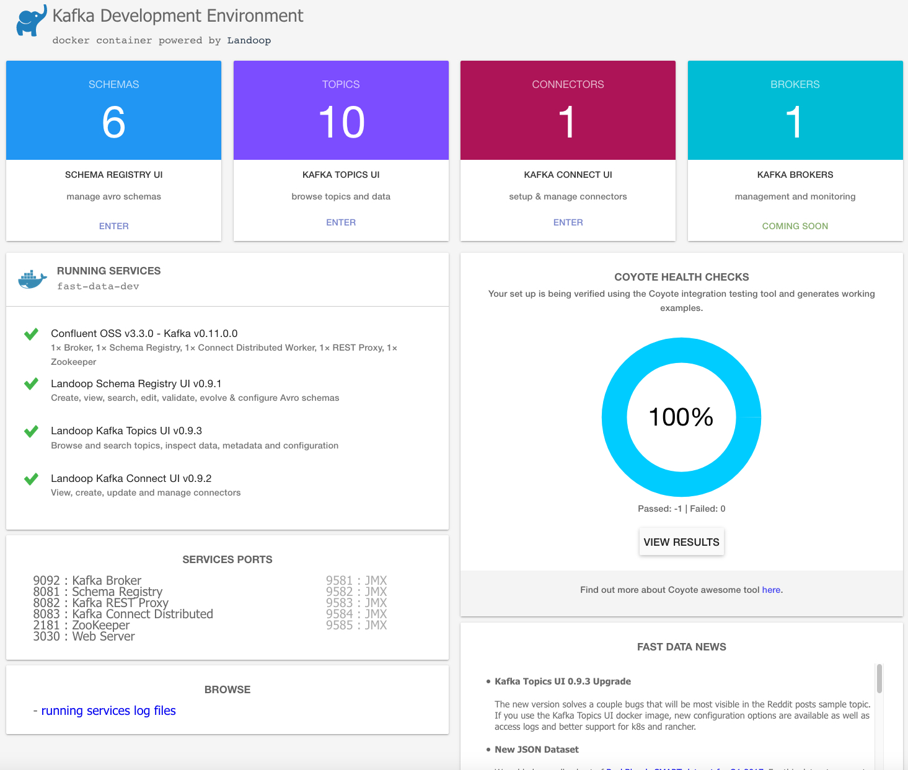
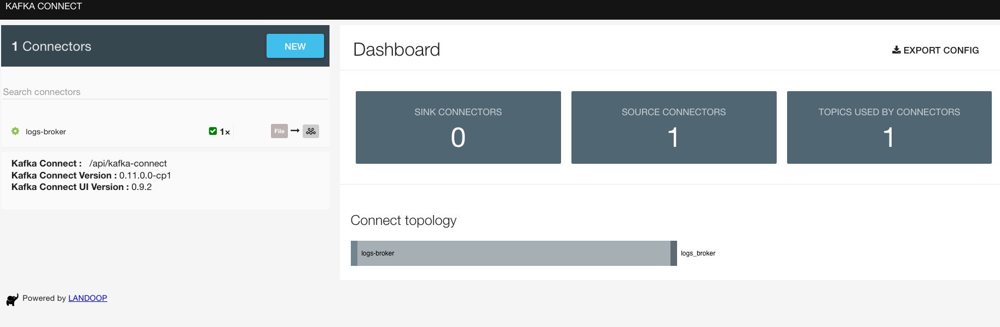
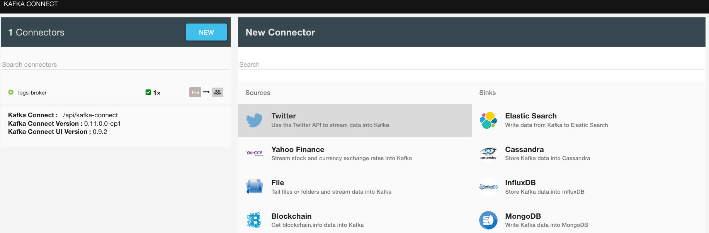
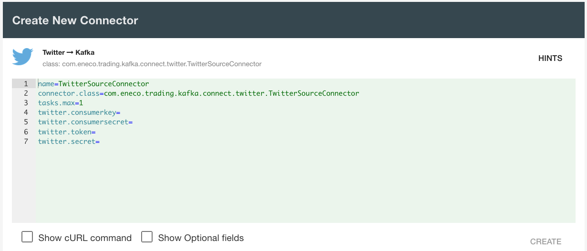
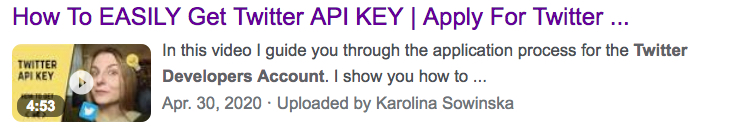
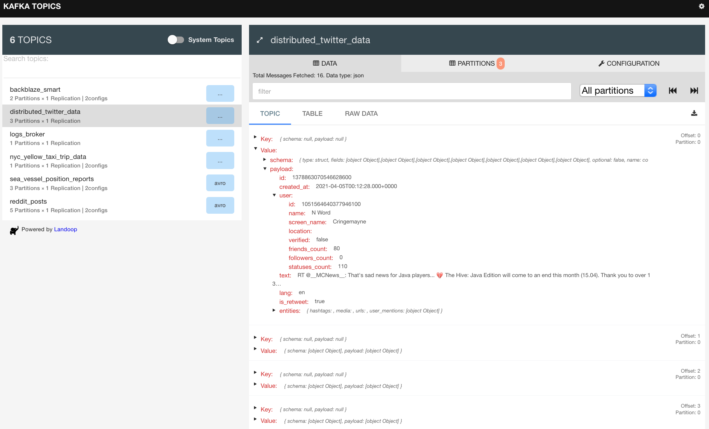
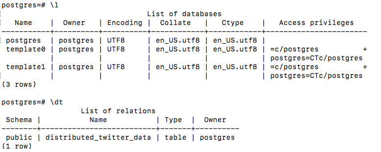
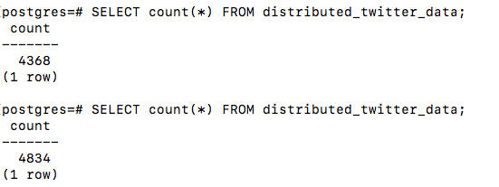

# Distributed Twitter Data Analysis    

Purpose of this project is to apply Kafka skills to build a distributed data pipeline receiving real-time data from Twitter API and save it to a postgres database. Future updates on this project including but not limited to:

* Real-time tweets sentiment analysis
* Reflecting real-time data changes using GraphQL
* Ongoing contributing social network graph for centrality analysis and community detection
 
OK, let's take a look at how to retrieve distributed data from Twitter.

First, creating a Kafka cluster and postgres using the docker-compose.yaml file with command:
```
docker-compose up kafka-cluster postgres
```
The docker-compose.yaml file looks like:
```
version: '2'

services:
  # kafka cluster.
  kafka-cluster:
    image: landoop/fast-data-dev:cp3.3.0
    environment:
      ADV_HOST: 127.0.0.1         
      RUNTESTS: 0                 # Disable Running tests so the cluster starts faster
    ports:
      - 2181:2181                 # Zookeeper
      - 3030:3030                 # Landoop UI
      - 8081-8083:8081-8083       # REST Proxy, Schema Registry, Kafka Connect ports
      - 9581-9585:9581-9585       # JMX Ports
      - 9092:9092                 # Kafka Broker


  # postgres as sink with configuration
  postgres:
    image: postgres:9.5-alpine
    environment:
      POSTGRES_USER: postgres     # define credentials
      POSTGRES_PASSWORD: postgres # define credentials
      POSTGRES_DB: postgres       # define database
    ports:
      - 5432:5432                 # Postgres port
```
Landoop is an awesome Kafka UI platform where you could easily monitor your Kafka. 

Reference: https://hub.docker.com/r/landoop/fast-data-dev/

Next, let's access landoop inside docker.

```
docker run --rm -it --net=host landoop/fast-data-dev:cp3.3.0 bash
```
Under the root account, we could set up our Kafka topic and Kafka consumer.
```
# TwitterSourceConnector in distributed mode:
# Access landoop fast-data-dev as root 
docker run --rm -it --net=host landoop/fast-data-dev:cp3.3.0 bash
```
```
# Create kafka topics
kafka-topics --create --topic distributed_twitter_data --partitions 3 --replication-factor 1 --zookeeper 127.0.0.1:2181
```
```
# Start a console consumer on that topic
kafka-console-consumer --topic distributed_twitter_data --bootstrap-server 127.0.0.1:9092
```
Now, it is time to take a look at the Landoop UI with url: http://127.0.0.1:3030/

The main page is looks like:



Click the "KAFKA CONNECTOR UI" button to access the connector page. 



Click the "NEW" button to create a Twitter connector.



You can see that there are many existing connectors. Let's select the "Twitter" one under the "Source" category. 



Here, we need to copy the config from the source/source-twitter-distributed.properties.sh file to the Landoop connector config panel.

```
# Connector configuration
name=source-twitter-distributed
connector.class=com.eneco.trading.kafka.connect.twitter.TwitterSourceConnector
tasks.max=1
topic=distributed_twitter_data
key.converter=org.apache.kafka.connect.json.JsonConverter
key.converter.schemas.enable=true
value.converter=org.apache.kafka.connect.json.JsonConverter
value.converter.schemas.enable=true

# Twitter connector specific configuration
twitter.consumerkey=PUT YOU OWN CONFIG
twitter.consumersecret=PUT YOU OWN CONFIG
twitter.token=PUT YOU OWN CONFIG
twitter.secret=PUT YOU OWN CONFIG

track.terms=programming,java,kafka,scala
language=en
```
In this config, the topic value is the one we used to create Kafka topics. 
```
kafka-topics --create --topic distributed_twitter_data --partitions 3 --replication-factor 1 --zookeeper 127.0.0.1:2181
```
The max tasks is 1 because we only have one data source which is Twitter.
`org.apache.kafka.connect.json.JsonConverter` will be used to convert json data from Twitter API.

The consumer key and access token are generated from the app created from the Twitter developer portal. This video will help you register a Twitter developer account, how to create an app, and generate access tokens.

<a href="https://www.youtube.com/watch?v=vlvtqp44xoQ
" target="_blank"></a>

After creating this Twitter connector, we can see a new connector named "source-twitter-distributed" with a twitter icon pointing to a Kafka icon.


Now, we can check distributed data from the Landoop topic page.



Great! We have data from Twitter now. Then we need to set up a sink connector to save the distributed data to postgres.

From the Landoop Kafka connector page, clicking "NEW" button, then we can find the "Jdbc" connector from the "Sinks" category. Let's select it and copy the sink/postgres/sink-postgres-twitter-distributed.properties file. 

```
# Basic configuration for our connector
name=sink-postgres-twitter-distributed
connector.class=io.confluent.connect.jdbc.JdbcSinkConnector

tasks.max=1
topics=distributed_twitter_data
# enable schemas conversion
key.converter=org.apache.kafka.connect.json.JsonConverter
key.converter.schemas.enable=true
value.converter=org.apache.kafka.connect.json.JsonConverter
value.converter.schemas.enable=true
# JDBCSink connector specific configuration
# http://docs.confluent.io/3.2.0/connect/connect-jdbc/docs/sink_config_options.html
connection.url=jdbc:postgresql://postgres:5432/postgres
connection.user=postgres
connection.password=postgres
insert.mode=upsert
# we want the primary key to be offset + partition
pk.mode=kafka
# default values:
pk.fields=__connect_topic,__connect_partition,__connect_offset
fields.whitelist=id,created_at,text,lang,is_retweet
auto.create=true
auto.evolve=true
```
Similar with the source connector, max tasks is 1 because we just use one postgres to receive data. Topics value is "distributed_twitter_data".
The user and entity data are nested json format and our Jdbc connector does not support it. 

After the sink connector is created, we should be able to access the data we got from Twitter.

* Find postgres container id and access it
```
docker ps
```

```
docker exec -it YOUR POSTGRES CONTAINER ID bash
```

```
psql -U postgres
```

* Check postgres database and tables
```
postgres=# \l
```

```
postgres=# \dt
```




That is everything for now. We have real-time data coming from Twitter. Looking forward to adding the Machine learning and Neo4j parts to this project.
